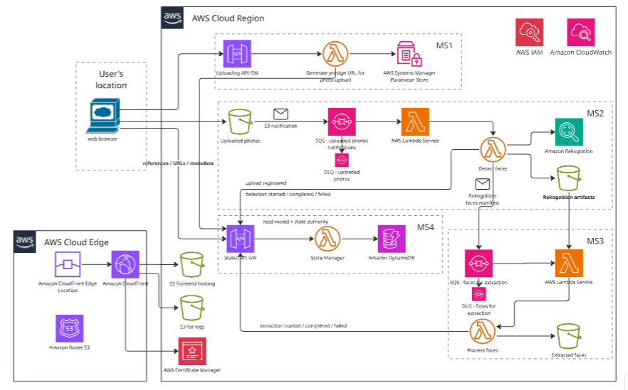
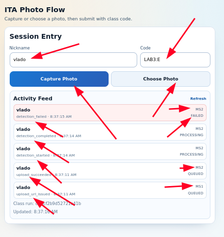
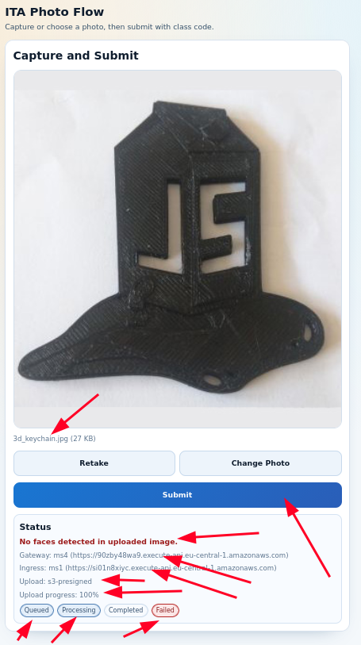
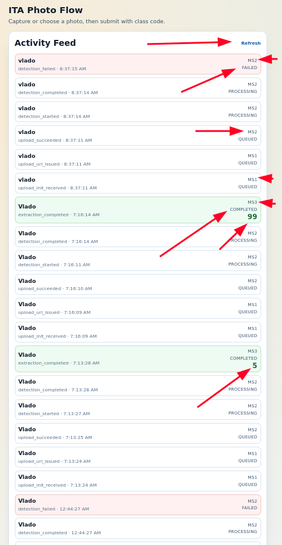

# 4-ita

Serverless demo application for classroom-scale photo ingestion and face extraction on AWS.

## Repository

- Canonical GitHub repository: [https://github.com/dosomelearning/ita](https://github.com/dosomelearning/ita)

## Related Docs

- [`AGENTS.md`](AGENTS.md) (project working rules)
- [`ARCHITECTURE.md`](ARCHITECTURE.md) (architecture decisions and rationale)
- [`docs/README.md`](docs/README.md) (project documentation map)
- [`docs/system-checklist.md`](docs/system-checklist.md) (system-wide task tracker)
- [`docs/testing/README.md`](docs/testing/README.md) (centralized testing and diagnostics strategy)
- [`docs/process/photo-upload-processing-sequence.md`](docs/process/photo-upload-processing-sequence.md) (end-to-end photo upload and processing sequence)
- [`b-infra/README.md`](b-infra/README.md)
- [`b-ms1-ingress/README.md`](b-ms1-ingress/README.md)
- [`b-ms2-detection/README.md`](b-ms2-detection/README.md)
- [`b-ms3-faces/README.md`](b-ms3-faces/README.md)
- [`b-ms4-statemgr/README.md`](b-ms4-statemgr/README.md)
- [`f-spa/README.md`](f-spa/README.md)

## What This Project Is

`4-ita` is a learning/demo system that shows how to build a resilient, managed, serverless workflow for concurrent mobile users.
Students use a mobile-first SPA to capture/upload images, backend services process images with AWS managed services, and extracted face images are made available back to the frontend.

## Architecture Diagram

Source image: `img/ita-arch-diag1.png`.
For decision rationale, resource ownership semantics, and tradeoffs not fully shown visually, see [`ARCHITECTURE.md`](ARCHITECTURE.md).

## App Screenshots

The screenshots below document the current SPA user flow from session setup to submit/status and activity history.
Each image includes red-arrow annotation overlays used to point out key UI controls and runtime states.

### 1) Session Entry

- Shows `Session Entry` with `Nickname` and `Code` fields populated.
- Primary entry actions are visible: `Capture Photo` and `Choose Photo`.
- Includes embedded `Activity Feed` rows with pipeline state labels like `MS1 QUEUED`, `MS2 PROCESSING`, and `MS2 FAILED`.

### 2) Capture and Submit

- Shows a selected photo preview (`3d_keychain.jpg`) before submit.
- Exposes the capture/edit controls: `Retake`, `Change Photo`, and primary `Submit`.
- Status panel demonstrates a failure path: `No faces detected in uploaded image.` with stage badges (`Queued`, `Processing`, `Completed`, `Failed`) and endpoint context (`Gateway`, `Ingress`, `Upload`).

### 3) Activity Feed

- Shows a longer mixed-status event timeline in the `Activity Feed`.
- Demonstrates queued/processing/failure transitions and successful `MS3 COMPLETED` rows carrying face-count values (for example `99` and `5`).
- Confirms recent-first operational visibility for classroom/demo runs.

## Working Map (Read This First)

Use this order to understand and continue the project:
Note: in markdown-capable viewers, the module `README.md` entries below are **clickable links**.

1. This root `README.md` for system intent and architecture direction.
2. Diagram(s) in `img/` for current architecture reference.
3. System docs in `docs/` for execution tracking:
   - [`docs/README.md`](docs/README.md)
   - [`docs/system-checklist.md`](docs/system-checklist.md)
   - [`docs/testing/README.md`](docs/testing/README.md)
4. Module-level `README.md` files for implementation details:
   - [`b-infra/README.md`](b-infra/README.md)
   - [`b-ms1-ingress/README.md`](b-ms1-ingress/README.md)
   - [`b-ms2-detection/README.md`](b-ms2-detection/README.md)
   - [`b-ms3-faces/README.md`](b-ms3-faces/README.md)
   - [`b-ms4-statemgr/README.md`](b-ms4-statemgr/README.md)
   - [`f-spa/README.md`](f-spa/README.md)

If documentation and diagrams diverge, pause and reconcile before implementation.

## Business Problem and Value

Organizations running short, high-attendance sessions (classes, workshops, bootcamps, events) need a fast way to collect participant photos, process them, and return structured results without building a large custom platform.

This project addresses that need with a low-operations, cloud-native architecture focused on:

- Rapid session onboarding and controlled participant access.
- Predictable processing under bursty, concurrent uploads.
- Operational resilience through decoupled service workflow.
- Clear cost-to-usage alignment for periodic/event-based workloads.
- Reusable architecture patterns that can be adapted for larger production contexts.

Reference situations where this architecture is applicable:

- Classroom exercises where instructors need near-real-time photo analysis results.
- Training workshops that include attendance, engagement, or activity scoring from submitted images.
- Hackathons or short innovation events requiring secure, time-boxed participant upload flows.
- Corporate learning labs that need temporary, controlled access without full enterprise identity rollout.
- Pilot programs validating event-driven photo-processing workflows before production-scale investment.

## Academic Use and Data Protection Notice (EU)

This project is for academic research, technical exploration, and architecture problem-solving only. It is not intended for real-world personal data acquisition programs or production identity-processing workflows.

Mandatory handling policy for classroom runs:

- Data collection is limited to the class exercise context and time window.
- Images and derived face artifacts are not used for any purpose beyond the active class exercise.
- No collected image data is used for secondary analysis, model training, sharing, or downstream processing after class completion.
- All collected photos and derived artifacts must be deleted when the class session ends.
- No photos (originals or derived variants) are retained permanently in any form.

Given the EU context of this project, these constraints are treated as core design requirements, not optional operational preferences.

## Core Goals

- Demonstrate resilient AWS serverless architecture under concurrent class usage.
- Accept photo uploads from mobile-first frontend flow.
- Detect faces with Amazon Rekognition.
- Move source photos out of ingress `uploaded/` prefix after detection into `processed/faces/` or `processed/nofaces/`.
- Extract each detected face into an individual image artifact.
- Return processed results for frontend consumption.
- Expose a class activity feed (latest mixed pipeline events) to demonstrate concurrent resilient processing behavior.

## Resilience and Scalability Position

- Resilience is demonstrated through microservice decoupling with SQS-based asynchronous boundaries.
- Queue-based service separation is intentional architecture, not a classroom shortcut, and it directly supports independent scaling and failure isolation.
- "Classroom-scale" describes the operating/authentication scope of this demo, not a limit on backend scalability potential.
- The event-driven design can scale beyond classroom concurrency without changing core service boundaries.

## Access Model (Current Direction)

- No Cognito authentication in this project.
- Access is gated by an instructor-defined shared password stored in SSM Parameter Store.
- The shared password is short-lived: valid only for the duration of a class session and rotated for each class run.
- Presigned upload URL issuance is allowed only when shared password validation succeeds.
- Requests with invalid password are rejected before entering protected processing flow.
- API Gateway endpoints must be rate-limited.
- Outside an active class window, the system is intended to be operationally non-accessible from the public flow. Exact enforcement controls are tracked as implementation items and are treated as mandatory security requirements, not optional hardening.

## Repository Layout

- `b-infra` - foundational/shared infrastructure (for example CloudFront, frontend hosting bucket, shared data buckets, Route53, ACM, baseline logging/observability).
- `b-ms1-ingress` - ingress microservice (request admission + presigned URL workflow).
- `b-ms2-detection` - detection microservice (face detection orchestration).
- `b-ms3-faces` - face extraction/storage microservice.
- `b-ms4-statemgr` - state/aggregation microservice (status, activity feed, and flow state).
- `f-spa` - React + TypeScript single-page frontend (mobile-first UX).
- `img` - architecture and supporting diagrams.

Directory names above are canonical and intentionally locked.

## Ownership and Isolation Model

- This repository is a monorepo, but backend services remain isolated/autonomous units.
- `b-infra` contains only project-foundational/shared AWS resources.
- Each backend microservice owns its own SAM template and service-owned resources.
- Cross-service dependencies must be via explicit contracts (API, events, storage contracts), not implicit in-process coupling.
- Shared resources should expose stable outputs; service templates consume those outputs without transferring ownership.

## Microservice Boundaries (Diagram vs Ownership)

- The architecture diagram shows logical runtime boundaries (`MS1`, `MS2`, `MS3`, `MS4`), not CloudFormation/SAM ownership by itself.
- Template/resource ownership is defined as:
  - `b-infra`:
    - Shared/foundational platform resources only (CloudFront, hosting S3, Route53, ACM, shared buckets, baseline logging/observability, and explicitly shared wiring).
  - `b-ms1-ingress`:
    - Ingress service resources in its own SAM template (upload-init API/Lambda and service-specific IAM/config).
  - `b-ms2-detection`:
    - Detection service resources in its own SAM template (worker Lambda, Rekognition integration, service-specific IAM/config).
  - `b-ms3-faces`:
    - Face extraction service resources in its own SAM template (worker Lambda and service-specific IAM/config).
  - `b-ms4-statemgr`:
    - State manager resources in its own SAM template (state API/Lambda/table(s) unless explicitly marked shared).
- Rule of precedence when unclear:
  - Keep `b-infra` for shared foundation.
  - Keep business-service resources inside the owning microservice template.
  - If a resource seems shared, document ownership explicitly before implementation.

## Technology Baseline

- OS target for development: Fedora 43+.
- Frontend: React + TypeScript.
- Backend: Python 3.12 on AWS SAM.
- Python environment for automation/agent work: `conda_py_env_312`.

## Lambda Runtime Guardrail (Mandatory)

- Initialize AWS SDK clients (`boto3.client`, `boto3.resource`, sessions, and similar SDK clients) in module-global scope.
- Do not initialize AWS SDK clients inside Lambda handlers or per-request code paths.
- Reuse global clients across warm invocations.
- This rule applies to `MS1`, `MS2`, `MS3`, `MS4`, and any future Lambda services in this repository.

## Current Status

Project is in bootstrap/setup phase.
Code, tests, and execution scripts are being created incrementally, with documentation-first guidance to keep work stateless and easy to continue.

## Next Milestones

- Finalize per-module `README.md` files with canonical `install`/`test`/`lint`/`run` commands.
- Scaffold SAM backend services and shared infra.
- Scaffold frontend SPA and upload workflow.
- Define initial end-to-end flow contract between frontend and ingress microservice.
