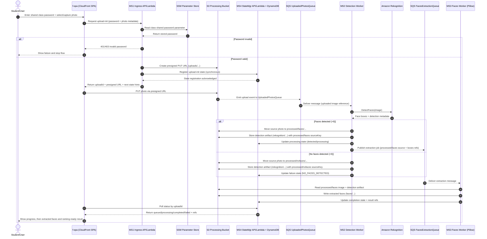

# Photo Upload Processing Sequence

This document describes the end-to-end runtime process order for the classroom photo flow, based on current architecture constraints in `README.md`, `f-spa/README.md`, and `ARCHITECTURE.md`.

## What This Diagram Covers

The sequence models the complete path from user action in the SPA to final processed face results:

1. Admission at ingress (`MS1`) with shared password validation against SSM.
2. Presigned upload flow to S3 for accepted requests.
3. Initial workflow state registration in `MS4`.
4. Asynchronous processing handoff to `MS2` via shared queue.
5. Face detection in `MS2` using Rekognition.
6. Post-detection source photo relocation in `MS2` from `uploaded/` to:
   - `processed/faces/` when faces were detected.
   - `processed/nofaces/` when no faces were detected.
7. Detection artifact persistence in `rekognition/` using relocated source key.
8. Asynchronous extraction handoff to `MS3` only when faces were detected.
9. Face extraction in `MS3` and result writes to S3.
10. State/result projection in `MS4` for frontend polling.
11. SPA polling and final result rendering.

It also includes the explicit invalid-password rejection branch, which terminates before entering protected upload/processing flow.

## Recommended Build Order

Implementation should follow dependency order implied by the sequence:

1. Validate shared platform readiness in `b-infra` (processing bucket, boundary queues/DLQs, and required outputs).
2. Implement `MS4` minimal contract-first slice:
   - Synchronous upload-init registration endpoint for `MS1`.
   - Status read endpoint for frontend polling.
   - Backing persistence model for workflow states.
3. Implement `MS1` admission flow:
   - Shared password validation via SSM Parameter Store.
   - Presigned upload URL issuance.
   - Mandatory synchronous `MS1 -> MS4` upload-init registration before success response.
4. Implement `MS2` detection worker:
   - Consume upload queue.
   - Run Rekognition detection.
   - Move processed source photo to `processed/faces` or `processed/nofaces`.
   - Persist detection artifacts.
   - Update `MS4` state and publish extraction job with relocated `sourceKey` when faces were found.
5. Implement `MS3` extraction worker:
   - Consume extraction queue.
   - Read original image + detection artifacts.
   - Create/store extracted face assets.
   - Finalize result state in `MS4`.
6. Wire frontend runtime to real `MS1` and `MS4` endpoints after backend contracts above are stable.

## Sequence Diagram Source

- Source file: `img/ita-photo-flow-sequence.mmd`

## Embedded Diagram

